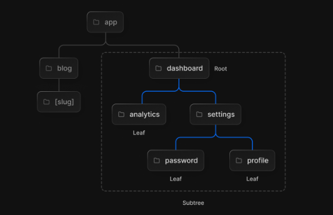
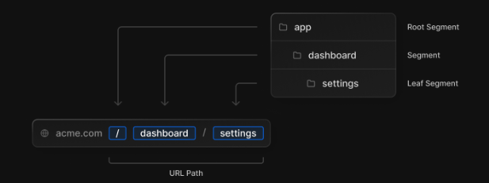
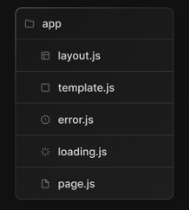
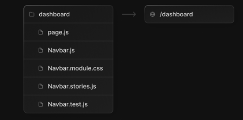
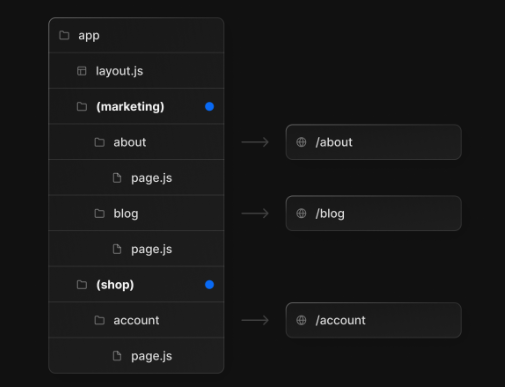
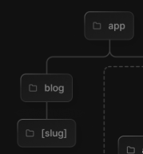
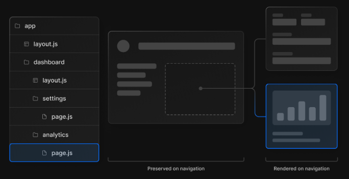
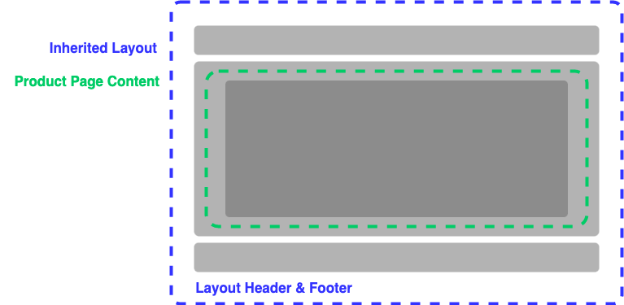
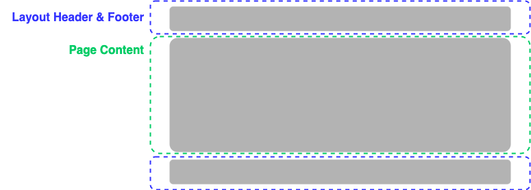

# How It Works

Using NextJS 13, we have access the following amazing features.

## Routing

Routing with Next13 is made easy with the use of the `app/` directory. Each **folder** within the `app/` directory is translated to a route in the URL path.

This concept allows you to easily break down the components of your code aligned with the architecture of the UI. Take the following folder structure:

_note: images are taken from the [NextJS Beta documentation](https://beta.nextjs.org/docs/routing/)_



The above folder tree represents the component breakdown of a simple blog app with an administrator section. Each nested folder creates the corresponding nested URL path in the app.

A more complete example of this can be seen here:



### Conventions

Each folder in the `app/` directory can contain any file of your choice, including some special reserved files.



Here is what they do:

-   **page.jsx**: The unique UI of the route, simply, the JSX of the page you are browsing.
-   **layout.jsx**: Defines shared layouts that can be spread across multiple pages based on the nesting of the pages that follow it. For example, a navigation bar, a side menu, a banner, etc.
-   **loading.jsx _[optional]_**: Defines the loading UI for the corresponding section of UI it resides with. Especially useful for skeleton loading or and generic data fetching.
-   **error.jsx _[optional]_**: Defines the error UI for the part of the UI it resides with. Used to isolate a section of the UI that may need its own error handler.
-   **template.jsx _[optional]_**: Similar to layouts, but on navigation, a new instance of the component is mounted and the state is not shared.
-   **head.jsx _[optional]_**: Defines the content of the `<head>` tag for the route at which it resides.

On top of these reserved files, this folder structure allows you to **colocate** other related files within the same directory, this can be useful for styling and testing.



In addition the above features, we are able to **group** routes, organising our code without affecting the path of the URL. This can be achieved using parenthesis in the folder names like so:



### Dynamic Routing

Dynamic routes are useful for items that change, but persist the same UI layout. This usually happens in blog posts or products on a eCommerce store.

Next13 makes this easy by wrapping your folder name in square brackets, as depicted here:



## Server Components and Server-Centric Routing

Natively, NextJs supports server side rendering, and now Next13 favours this by default. A previously used client-centric routing has now been changed to server-centric routing to align with server-components and data fetching.

It is important to keep in mind that although routing is now _server-centric_, the router uses _client-side navigation_. This means that when a user browses a new route, the page will not be reloaded - instead, NextJs will on render the segments that change.

### What does this look like in practice?

This **partial rendering** means that anything _above_ the segment in the current route tree, will not re-render or re-fetch, therefore routes with a shared layout, will be preserved across navigation.



### Is my component server-side or client-side?

How do you know whether your components is server-side or not? NextJS have a great example of this [here](https://beta.nextjs.org/docs/rendering/server-and-client-components#when-to-use-server-vs-client-components)

My understanding on this, is that you should only use a client component when you need to apply interactivity, and event listeners, or you need browser-only API's such as hooks.

# Walkthrough

## Project & Code Layout

This project uses the following root folders:

-   `app/`: Pages and URL Routes
-   `components/`: UI Blocks & Components
-   `pages/api/`: Build your API with NextJS
-   `public/`: Public assets and images

## JS Config

By default, NextJS supports the use of the `jsconfig.json` file. Here, we can define shortcut paths to locations in our project for cleaner imports.

## Root Layout and Page Directory, with Head component.

At the route of the project, we have used the `layout`, `page`, and `head` file.

The root layout holds the Navigation bar and the Footer - these will be passed through to every child view in the app.



## Analytics Component

Analytical components can be added to the root layout and will cascade through the whole application. Most of these, like the one from `vercel`, use browser API's and cannot be server components. It is ideal to keep the root layout a server component where possible, and therefore we can get around this by wrapping the analytics in our own components and makinng that a client component.

## Route Grouping with Login and Register Layout

We can see an example of nested layouts with the login and register routes - where the card is the only component that changes, the welcome message remains in the layout. This means that switching between these routes only renders what it needs to.

## Main product screen

Heading to the main product page, we can fetch data and render it in a section defined in the layout page.



## Dynamic Routes

Using information from the product, we can push dynamic routes via the `uid`.

## Data Fetching & Caching

We can fetch data within the components using `fetch`, and manage the cache of each.

Fetch with nextjs supports the following caching methods.

Default, cache

```json
{ "cache": "force-cache" }
```

No cache

```json
{ "cache": "no-store" }
```

Revalidate

```json
{ "next": { "revalidate": 60 } }
```

## Loading Files & Suspense Boundaries

We can load entire pages with the `loading` file. Conversely, we can target individual components with the `suspense` boundary.

## Head Files

We can now modify the `<head>` tag for each page using the `head` file. This is useful in dynamic routes.

## Not-Found Files

The 404 notFound error can now be caught and managed by adding a `not-found` file to the relevant directory, this has been added to the dynamic routing for navigating to products that do not exist.

## API Folder

We can also define our API within the NextJS code, these API functions are split into Lambda functions and deistrubuted across the server.

These can be defined in the `pages/api/` folder.
